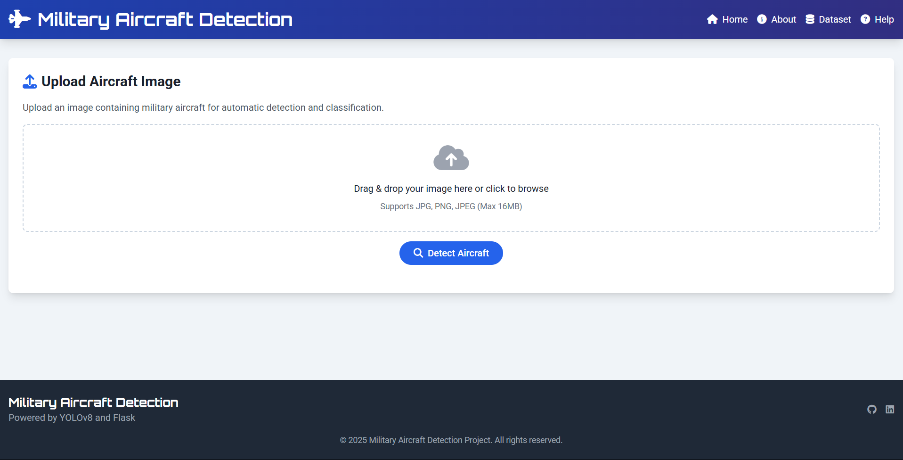
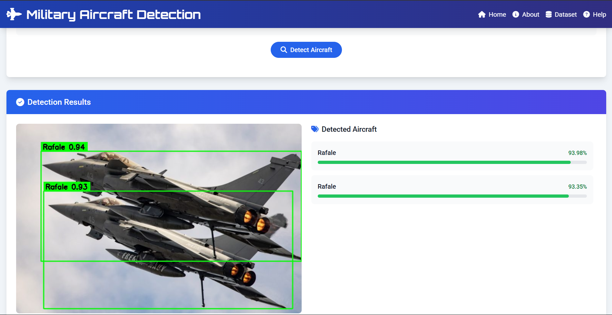
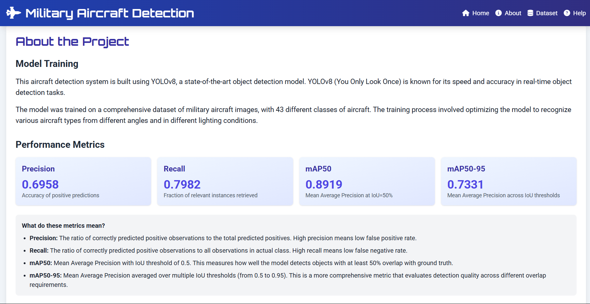

# Military Aircraft Detection using YOLOv8

This project implements an object detection system for military and civilian aircraft using the YOLOv8 model. The system is trained to identify 43 different types of aircraft with high accuracy.

## Performance Metrics

The model achieves the following performance on the validation dataset:
- **Precision**: 0.6958
- **Recall**: 0.7982
- **mAP50**: 0.8919
- **mAP50-95**: 0.7331

## Dataset

The dataset contains a diverse range of military and civilian aircraft organized into the following categories:

### 1. Fighter Jets
- F35, F22, F16, F15, F18, F14, F4, F117
- Su57, Su34
- J20
- JAS39 (Gripen)
- EF2000 (Eurofighter Typhoon)
- Rafale
- Mirage2000
- Tornado
- MiG31
- YF23

### 2. Bombers
- B1, B2, B52
- Tu95, Tu160

### 3. Transport/Cargo Aircraft
- C2, C5, C17, C130
- A400M

### 4. Special Purpose Aircraft
- E2 (Hawkeye - Early Warning)
- E7 (Wedgetail - AWACS)
- P3 (Orion - Maritime Patrol)
- U2 (Spy Plane)
- SR71 (Blackbird)
- RQ4 (Global Hawk - UAV)
- MQ9 (Reaper - UAV)

### 5. Attack Aircraft
- A10 (Thunderbolt/Warthog)
- AV8B (Harrier)

### 6. Other Aircraft
- V22 (Osprey - Tiltrotor)
- US2 (Amphibious Aircraft)
- Be200 (Amphibious Aircraft)
- AG600 (Amphibious Aircraft)
- Vulcan (Historic bomber)
- XB70 (Experimental bomber)

### Training Process

The training script will:
1. Set up GPU if available (CUDA/MPS support)
2. Create a dataset YAML configuration file
3. Train the YOLOv8 model (default: YOLOv8s)
4. Validate the model and calculate performance metrics
5. Save the trained model to the `models/` directory
6. Generate visualization plots in the `runs/` directory

## Project Structure

```
├── military/
│   ├── aircraft_names.yaml    # Class names and dataset configuration
│   ├── aircraft_train.txt     # List of training images
│   ├── aircraft_val.txt       # List of validation images
│   ├── images/                # Directory containing images
│   │   ├── aircraft_train/    # Training images
│   │   └── aircraft_val/      # Validation images
│   └── labels/                # Directory containing annotation labels
│       ├── aircraft_train/    # Training labels
│       └── aircraft_val/      # Validation labels
├── models/                    # Saved model weights
├── runs/                      # Training results and visualizations
├── screenshots/               # Application screenshots
├── app.py                     # Streamlit web application
├── train_aircraft_yolov8.py   # Main training script
├── requirements.txt           # Python dependencies
└── README.md                  # Project documentation
```

## Installation & Requirements

### Clone the Repository

```bash
git clone https://github.com/rishiakkala/Aircraft-Detection-Using-YOLOv8.git
cd Aircraft-Detection-Using-YOLOv8
```

### Install Dependencies

Create a virtual environment (recommended):

```bash
python -m venv aircraft_detection_env
source aircraft_detection_env/bin/activate  # On Windows: aircraft_detection_env\Scripts\activate
```

Install the required packages:

```bash
pip install -r requirements.txt
```

Or install manually:

```bash
pip install ultralytics
pip install streamlit
pip install matplotlib
pip install numpy
pip install torch torchvision
pip install pillow
pip install opencv-python
pip install pandas
```

For GPU acceleration (recommended):

```bash
pip install torch torchvision --index-url https://download.pytorch.org/whl/cu118
```

## How to Use

### Step 1: Train the Model

Run the training script to train your custom aircraft detection model:

```bash
python train_aircraft_yolov8.py
```

### Step 2: Run the Streamlit Application

After training the model, launch the interactive web application:

```bash
python app.py
```

The application will open in your default web browser

## Application Features

The interactive web application provides the following functionality:

### 🎯 Real-time Aircraft Detection
- Upload images for aircraft detection
- Real-time webcam detection
- Batch processing of multiple images
- Video file processing support

### ⚙️ Customizable Settings
- **Confidence Threshold**: Adjust detection sensitivity (0.1 - 1.0)
- **Model Selection**: Choose between different YOLOv8 model sizes
- **Class Filtering**: Select specific aircraft types to detect
- **Visualization Options**: Toggle bounding boxes, labels, and confidence scores

### 📊 Results Display
- Detection results with bounding boxes
- Confidence scores for each detection
- Class labels with aircraft names
- Detection statistics and metrics

## Application Screenshots

### Main Interface

*The main application interface showing upload options and settings*

### Image Detection Results

*Aircraft detection results with bounding boxes and confidence scores*

### About Page

*About the Model and Tech Stacks Used*

## Application Usage Guide

1. **Start the Application**: Run `python app.py`
2. **Configure Settings**: 
   - Set confidence threshold (recommended: 0.5)
   - Select model size based on your hardware capabilities
   - Choose specific aircraft classes to detect (or select all)
3. **Choose Input Source**:
   - **Upload Image**: Click "Browse files" to upload aircraft images
   - **Use Webcam**: Enable webcam for real-time detection
   - **Upload Video**: Process video files for aircraft detection
4. **View Results**: 
   - Detected aircraft will be highlighted with bounding boxes
   - Confidence scores and aircraft types will be displayed
   - Download processed images/videos with detections

## Customization & Configuration

### Training Parameters

You can modify the following parameters in the `main()` function of `train_aircraft_yolov8.py`:

- `model_size`: Model size ('n', 's', 'm', 'l', 'x')
- `epochs`: Number of training epochs (default: 100)
- `batch_size`: Batch size for training (default: 16)
- `img_size`: Input image size (default: 640)

### App Configuration

The App can be customized by modifying `app.py`:

- **Default confidence threshold**: Adjust the default detection confidence
- **Model path**: Point to your trained model weights
- **UI layout**: Customize the application interface
- **Supported formats**: Add support for additional image/video formats

## Troubleshooting

### Common Issues

1. **CUDA/GPU Issues**:
   ```bash
   # Check CUDA availability
   python -c "import torch; print(torch.cuda.is_available())"
   ```

2. **Model Loading Errors**:
   - Ensure the trained model exists in the `models/` directory
   - Check model path in the app configuration

3. **Memory Issues**:
   - Reduce batch size for training
   - Use smaller model size ('n' or 's')
   - Process smaller images

### System Requirements

- **Minimum**: 8GB RAM, CPU-only inference
- **Recommended**: 16GB RAM, NVIDIA GPU with 4GB+ VRAM
- **Optimal**: 32GB RAM, NVIDIA GPU with 8GB+ VRAM

## Model Information

This project uses YOLOv8 (You Only Look Once version 8), a state-of-the-art object detection model that provides:
- Real-time inference capabilities
- High accuracy for object detection tasks
- Support for various model sizes to balance speed and accuracy
- Easy integration and deployment

## Output

After training, you'll find:
- Trained model weights in the `models/` directory
- Training metrics and visualizations in the `runs/` directory
- Validation results showing model performance

## Contributing

Feel free to contribute to this project by:
- Adding more aircraft classes
- Improving the dataset quality
- Optimizing the training parameters
- Adding inference scripts for real-time detection
